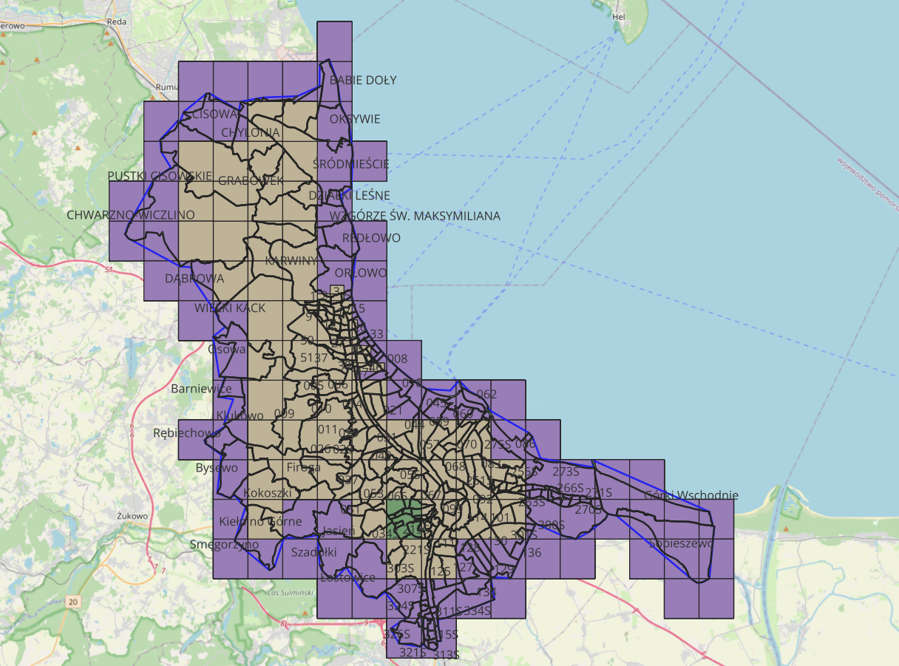

# Inference_data
Data for inference - high-res orthophotos

## Scope
- [QGIS project](QGIS_project/Skorowidze_Ortofotomapy_19-24_na_obszarze_3City.qgz)
- [spreadsheet with URLs for Wzgórze Mickiewicza](WzgórzeMickiewicza19-24.csv)
- [spreadsheet with URLs for whole interior](ggs19-24wew.csv)
- [spreadsheet with URLs for selected, valid imgs in whole interior](new_ggs_50_imgs.csv)
- [spreadsheet with URLs for 3City area with nearby extras](metrop19-24.csv)
- [spreadsheet with URLs for selected, valid imgs covering 3City area with nearby extras](new_ggs_125_imgs.csv)
- [Script for downloading images from URLs](imagery_downloader.py)

## Fine details
- *Mickiewicz* - godło: N-34-50-C-c-4-4
- metadata for years 2019-2024
- features RGBs and CIRs
- differs in pixel resolution in years
- for a few years extra small areas are provided (geo-narrow)
- see [Geoportal - usługi](https://www.geoportal.gov.pl/pl/usluga/)

## Depiction

## Credits
[Geoportal - Główny Urząd Geodezji i Kartografii](https://www.geoportal.gov.pl)

> Obliczenia wykonano z wykorzystaniem komputerów Centrum Informatycznego Trójmiejskiej Akademickiej Sieci Komputerowej (Computations were carried out using the computers of Centre of Informatics Tricity Academic Supercomputer & Network).
